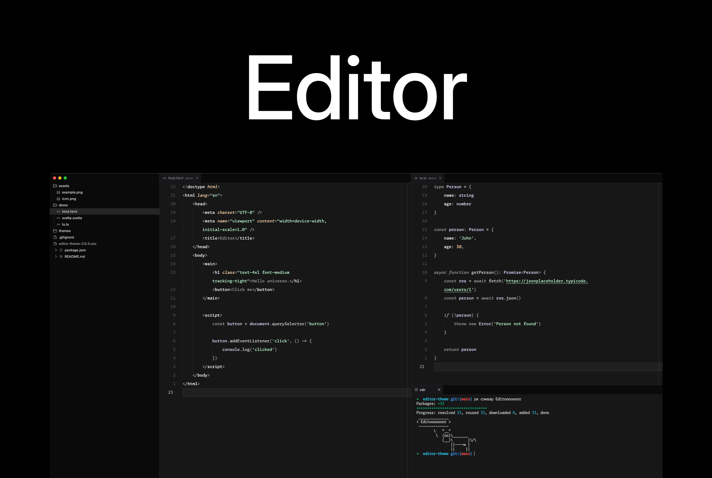

# Editor

Editor is a sleek dark theme for VS Code.



## Custom config

I personally use [Apc Customize UI++](https://marketplace.visualstudio.com/items?itemName=drcika.apc-extension) and a custom of other VS Code settings to further customize my editor.

Here's the relevant settings:

```json
// Editor
"breadcrumbs.enabled": false,
"editor.minimap.enabled": false,
"workbench.activityBar.location": "hidden",
"workbench.editor.labelFormat": "short",
"window.titleBarStyle": "native",
"workbench.startupEditor": "none",
"workbench.statusBar.visible": false,
"workbench.tree.indent": 12,
"explorer.compactFolders": true,
"explorer.fileNesting.enabled": true,

// Icons
"workbench.productIconTheme": "fluent-icons",
"workbench.iconTheme": "chalice-icon-theme",

// APC
"apc.activityBar": {
    "hideSettings": true,
    "itemMargin": 8,
    "itemSize": 36,
    "position": "bottom",
    "size": 40
  },
  "apc.electron": {
    "titleBarStyle": "hiddenInset",
    "trafficLightPosition": {
      "x": 11,
      "y": 10
    }
  },
  "apc.header": {
    "height": 36
  },
  "apc.listRow": {
    "height": 24
  },
  "apc.menubar.compact": false,
  "apc.statusBar": {
    "fontSize": 14,
    "height": 28,
    "position": "editor-bottom"
  },
  "apc.stylesheet": {
    // Remove editor action icons
    ".editor-actions": "display: none",

    // Align tabs to not overlap window controls when primary bar is hidden
    ".nosidebar .inline-tabs-placeholder": "width: 96px",

    // Remove primary side bar action icons
    ".title-actions": "display: none",

    // Remove primary side bar title
    ".title-label > h2": "display: none"
}
```

Font used: [Monaspace Argon](https://monaspace.githubnext.com/).

```json
"editor.fontFamily": "Monaspace Argon",
"editor.fontLigatures": "'ss01', 'ss02', 'ss03', 'ss04', 'ss05', 'ss06', 'ss07', 'ss08', 'calt', 'dlig'",
"editor.fontSize": 15,
"editor.fontWeight": 350,
"editor.lineHeight": 2.15,
"editor.inlayHints.fontFamily": "Monaspace Krypton",
```

## Thoughts

This is good enough for now. There are some other things I'd like to add eventuall, such as..

-   [ ] Custom terminal colors
-   [ ] A 'Light' version
-   [ ] A 'Dusk' version
-   [ ] A more comprehensive README ;)
